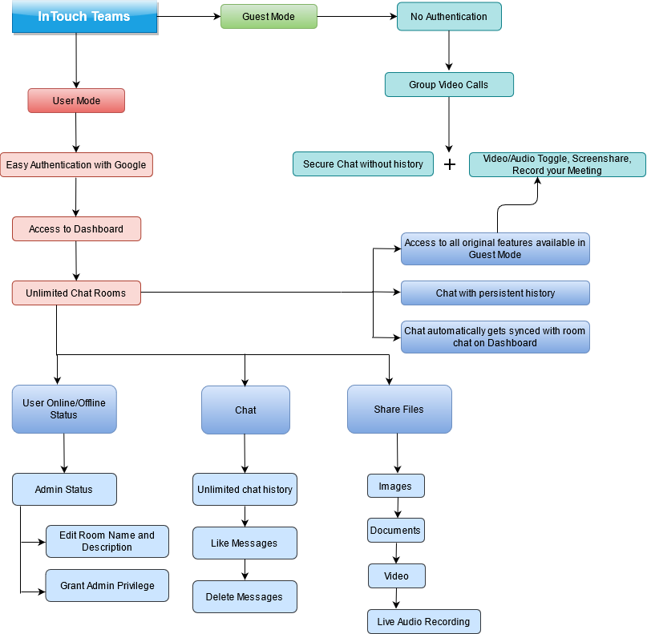

# InTouch Teams
(Tested on Google Chrome | Not Mobile Responsive)

[**Stay InTouch with Teams** - Try the application today!](https://intouch-videocall.herokuapp.com/)

[**Video Demo**](https://youtu.be/oWEpEadlcWU)

[**Design Document**](https://github.com/chandrashritii/InTouch-Teams-Project/wiki)

## Why is InTouch Teams different

- **Extensible** - The chat engine and videocall feature is built from scratch and with minimal dependencies. Additionally, it's database is hosted on Firebase. This makes the application highly extensible, i.e features can easily be integrated without worrying about interdependency between components, customization limits, and server overloading for video calls.
- **Adaptable** - The code is compartmentalized, i.e it is broken into components. Changing any feature is an efficient process with an assurance that no other component will be impacted directly.
- **Easy Integrations** - InTouch, as a platform, can be integrated into any organization's architecture as a microservice. Credits to the agile way of development.
- **Painless UI** - The UI is built with React Suite components, keeping the CSS to minimal which greatly increases site loading time, execution time, memory consumption
- **Hosted Database** - The database for the application is hosted on Firebase, making the application much more efficient and lightweight, decreasing the Database Throughput, and Database Response Time and increasing the Average response time.
- **CI/CD** - Deployed on Heroku with a fully functioning CI/CD pipeline, thus enforcing the Agile Methodology



## Video Call 
- Built with WebRTC, React, Node JS and Express
- Can host upto 8 people without video/audio quality loss

#### Features

- Secure chat in Guest Mode
- Persistent chat with unlimited history in User Mode (Users can access the chat before, during, and after the meeting. Additionally, users can access chat without joining the videocall as well)
- Video Grid View
- ScreenShare
- Record the Meeting (With the option of saving the recording directly to your local system)
- Video/Audio Toggle
- Share Room Link
- Picture in Picture Mode (Enabled for User Video)

## Chat Rooms
- Built with React, NodeJS, Express and Firebase

#### Features
- Unlimited Chat Rooms
- Unlimited Chat History
- File Transfer (Images, Videos, Documents) 
- Live Audio Recordings
- User Status (Online/Offline with login history)
- Like Messages
- Delete Messages
- Send emojis
- See Room Information
- Admin Privileges (Can edit room name and description)
- Unique User Profiles
- Editable User Profiles (NickNames, Profile Pictures)
- Chat stored and rendered in accordance with the chat and user history

## Tech Stack

- [WebRTC](https://webrtc.org/) for enabling VideoCall
- [Socket.io](https://socket.io/) for receiving, pushing and interacting with remote streams
- NodeJS client side backend for handling real time communications
- Express server to complement the NodeJS backend, serve static output, and host webRTC socket connections
- React and JavaScript for UI
- CORS for enabling Cross Origin Referencing between Websockets
- [Rsuite](https://rsuitejs.com/) Components for UI Layout
- Firebase Authentication with Google with React Context API
- Firebase Realtime Database for storing Message history, User Contexts, Room Database and Profiles
- Firebase Storage for storing user profile data and files shared on Chat 
- [React avatar editor](https://www.npmjs.com/package/react-avatar-editor) for User Profile pictures
- [VANTA](https://github.com/tengbao/vanta) for animated backgrounds
- [Emoji Picker](https://www.npmjs.com/package/emoji-picker-element) for sourcing emojis

#### Local Installation Steps

```
# Clone repository
$ git clone https://github.com/chandrashritii/InTouch-Teams-Project.git

# Make your way into the Project Folder
$ cd InTouch-Teams-Project

# Install dependencies from the root of the project folder
$ npm install

# Welcome to InTouch. Localhost should open at PORT 3000
$ npm start
```

#### Dependencies

*Node*@ >10 || <12

*React*@ ^16.6.0
