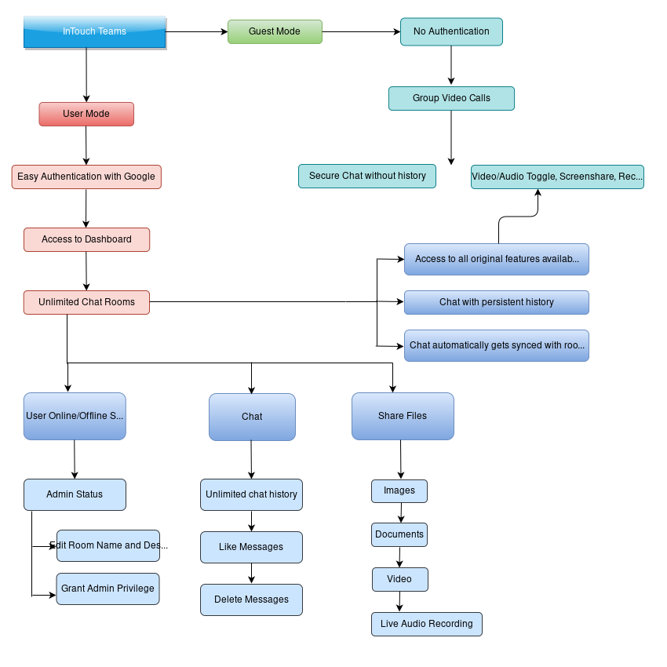

# InTouch Teams



[**Stay InTouch with Teams** - Try the application today!](https://intouch-videocall.herokuapp.com/)
[**Video Demo**](https://youtu.be/oWEpEadlcWU)

## Video Call 
- Built with WebRTC, React, Node JS and Express
- Can host upto 8 people without video/audio quality loss

#### Features

- Secure chat in Guest Mode
- Persistent chat with unlimited history in User Mode
- ScreenShare
- Record the Meeting
- Video/Audio Toggle
- Share Room Link

## Chat Rooms
- Built with React, NodeJS, Express and Firebase

#### Features
- Unlimited Chat Rooms
- Unlimited Chat History
- File Transfer (Images, Videos, Documents) 
- Live Audio Recordings
- User Status (Online/Offline with login history)
- Like Messages
- Delete Messages
- Send emojis
- See Room Information
- Admin Privileges (Can edit room name and description)
- Unique User Profiles
- Editable User Profiles (NickNames, Profile Pictures)
- Chat stored and rendered in accordance with the chat history

## Tech Stack

- [WebRTC](https://webrtc.org/) for enabling VideoCall
- [Socket.io](https://socket.io/) for receiving, pushing and interacting with remote streams
- Firebase Authentication with Google with React Context API
- Firebase Realtime Database for storing Message history, User Contexts, Room Database and Profiles
- Firebase Storage for storing user profile data and files shared on Chat 
- [React avatar editor](https://www.npmjs.com/package/react-avatar-editor) for User Profile pictures
- [VANTA](https://github.com/tengbao/vanta) for animated backgrounds
- [Emoji Picker](https://www.npmjs.com/package/emoji-picker-element) for sourcing emojis
- [Rsuite](https://rsuitejs.com/) Components for UI Layout


#### Local Installation Steps

```
# Clone repository
$ git clone https://github.com/chandrashritii/InTouch-Teams-Project.git

# Make your way into the Project Folder
$ cd InTouch-Teams-Project

# Install dependencies from the root of the project folder
$ npm install

# Welcome to InTouch. Localhost should open at PORT 3000
$ npm start
```
